**3/17/2026**  
**Made Wiring Diagram - 1h**

**3/10/2026**  
**Finished 3D Model - 2.3h**
I added all of components in the ways that I want them. I will keep the USB hub directly by the USB port on the printer to save weight on the toolhead. The camera and light arm slides in and out so I can choose not to use it, and the esp32 c3 box is magnetic so I can take it off as well. None of this should interfere with motion limits of the 3D printer.
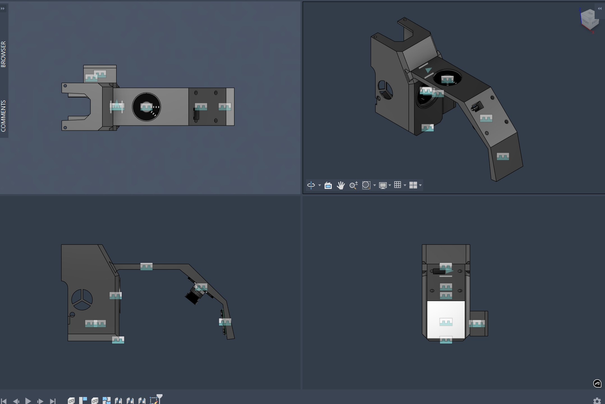
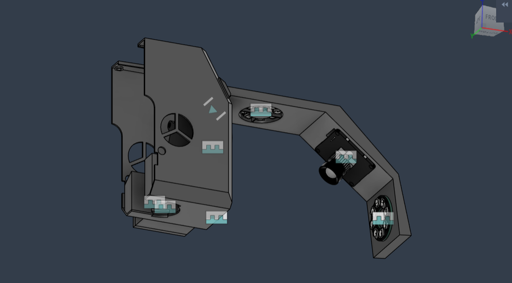
   
**3/4/2026**   
**Made a case and mount for the ESP-32 C3, planned layout - 0.5h**
I made a box to hold the ESP 32 C3, mounting to the toolhead with 2 6*3 mm magnets so I can take it off easily if I want. I made sure to add holes above the reset and boot buttons as well as the pin holes for wiring. I also planned the layout for the 2 LED rings and the UVC camera.
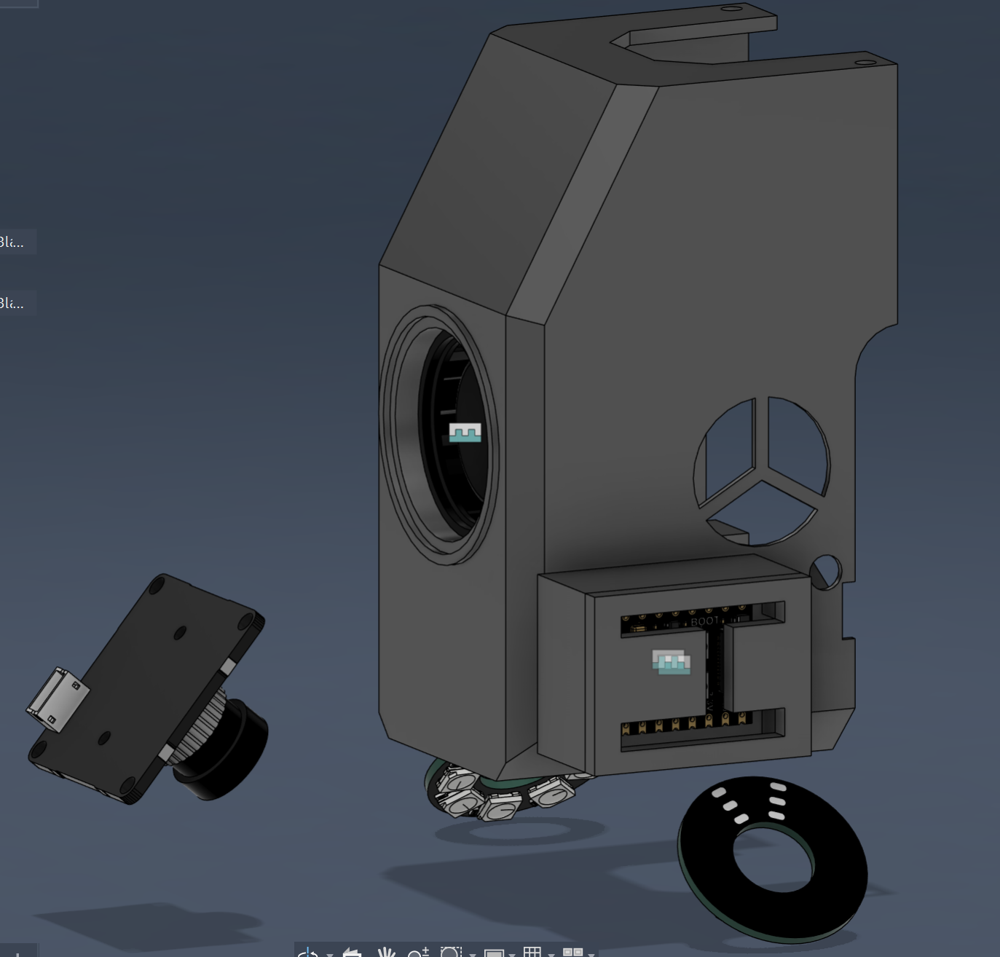
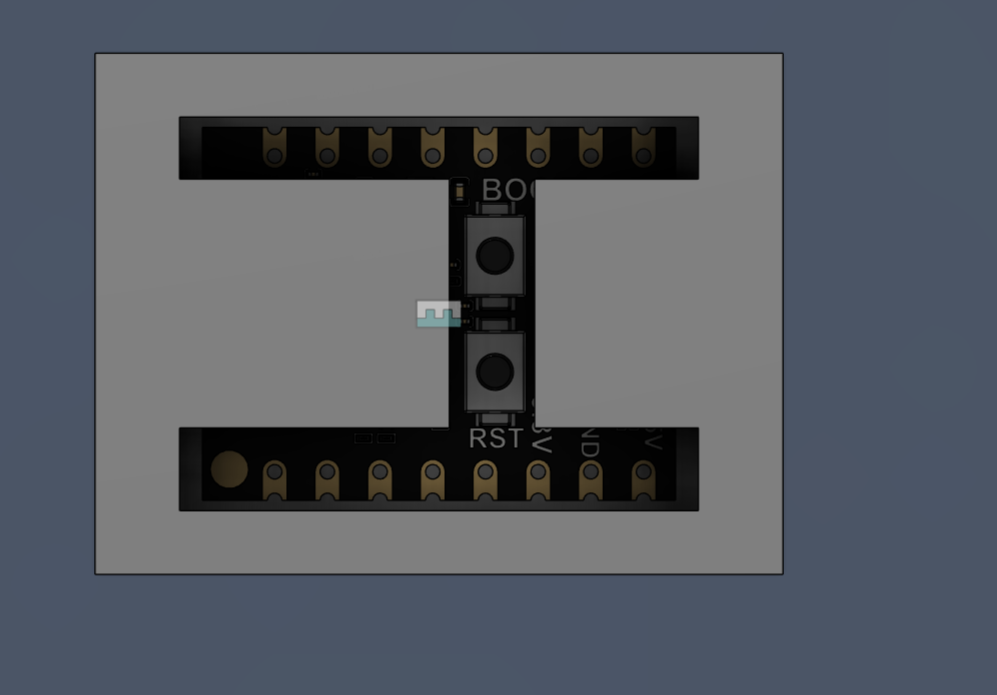
   
**3/4/2026**  
**Finished the 3D model of the toolhead cover - 2h**
I now have a model of the toolhead that should work. I've decided to not make the whole front of the cover magnetic so that it's more secure. However, I'll make the camera+light arm magnetic so I can remove it for prints where I don't want/need it. I also have a bill of materials. Next, I'll make a case for the esp-32 c3 to put on the side of the toolhead and an arm that magnetically attaches to the front of the toolhead with the camera and a small ring light.

The main change I made was adding the fan, screw holes to mount it, and the airflow chamber to direct air from the fan to the nozzle. I also added the holes on the side to mount the cover to the toolhead itself.
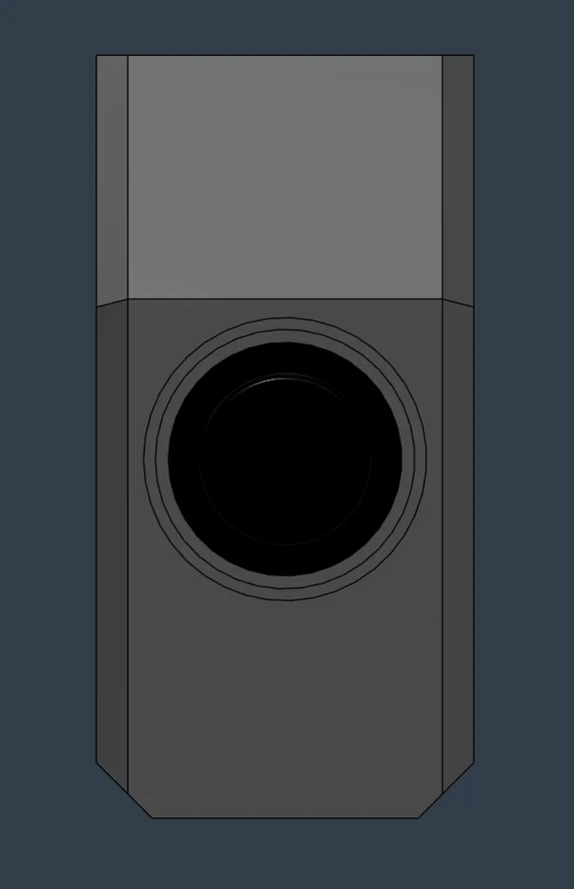
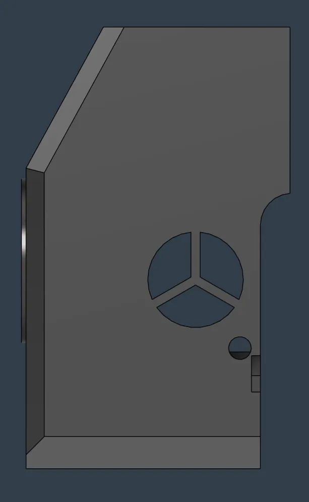
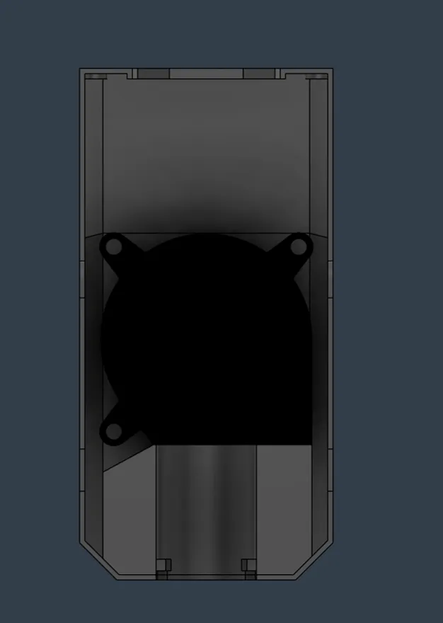
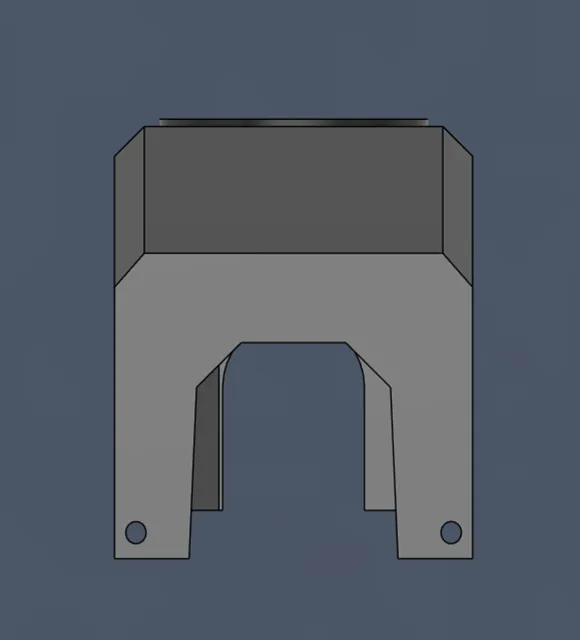
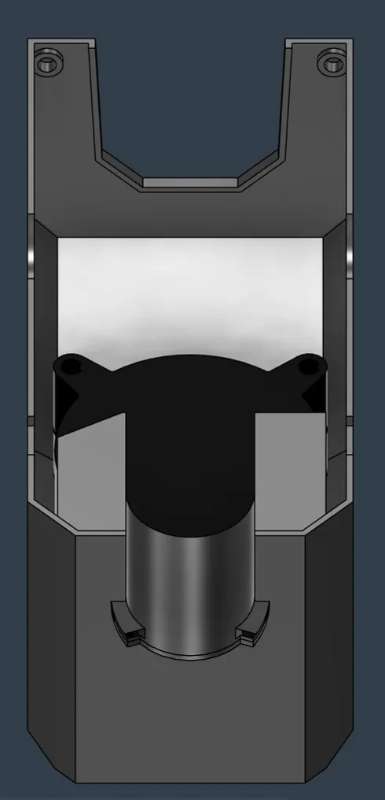
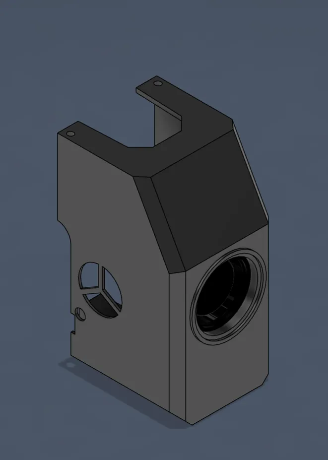

**3/3/2026**  
**Took measurements and modeled the toolhead cover - 2.5h**
I was going to use a model online of a magnetic toolhead cover for my printer as a starting point to save time, but it was too much work to edit the stl in Fusion, so I'm starting from scratch. Hopefully my measurements are accurate enough, particularly considering I don't have digital calipers.

This is what I have so far:
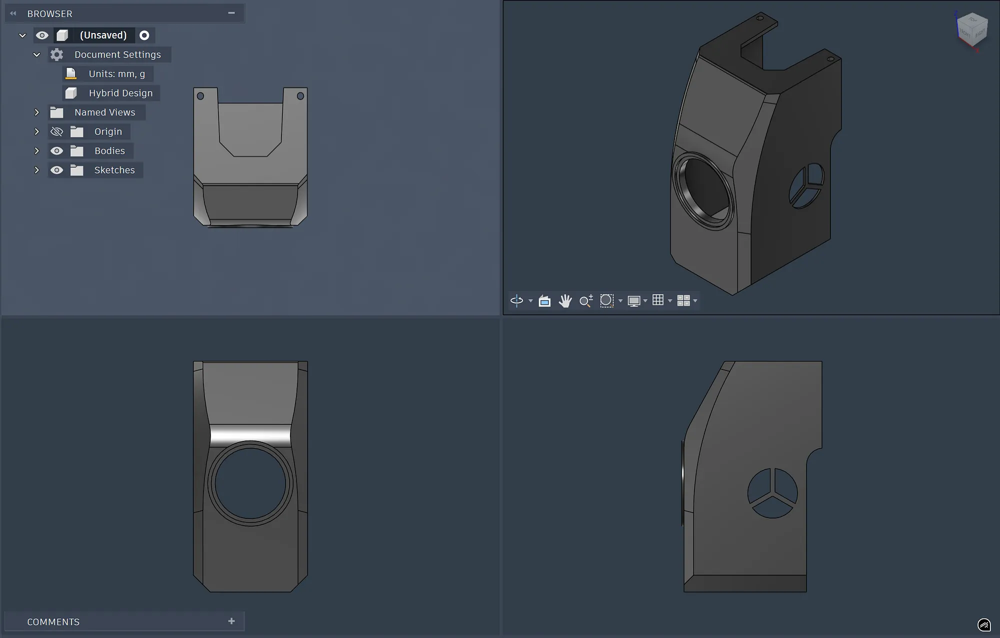
Its a bit different from the original but I think I'm going to keep the front flat at the bottom so I can do a bed clearing mod later.
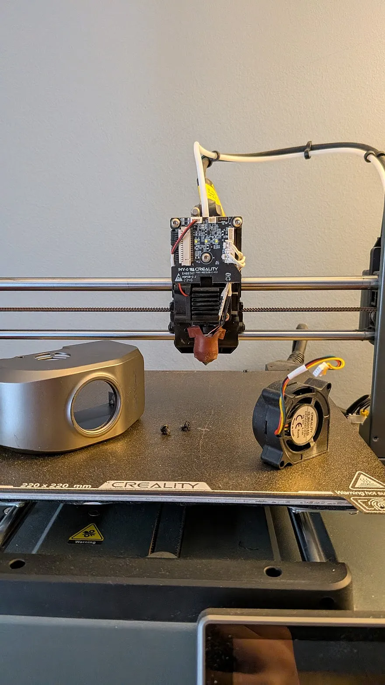

Next time, I will design the inside, with the airflow path from the fan to the nozzle, and the bottom hole for the nozzle. I will also add screw holes for the fan. I think I'm going to get rid of the glowing Creality logo but I haven't completely decided. I'll also choose components and sketch out the layout.
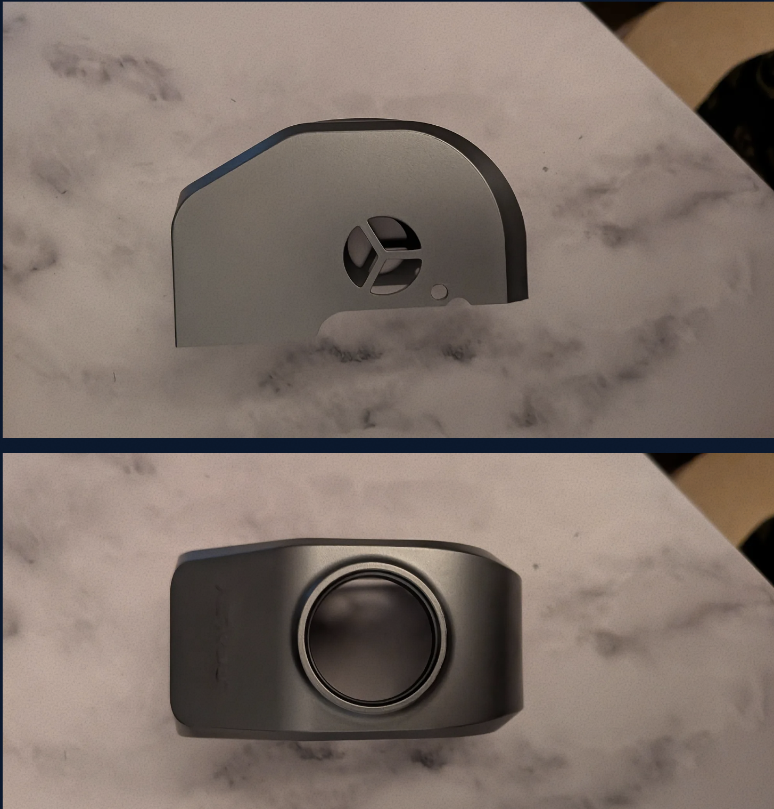
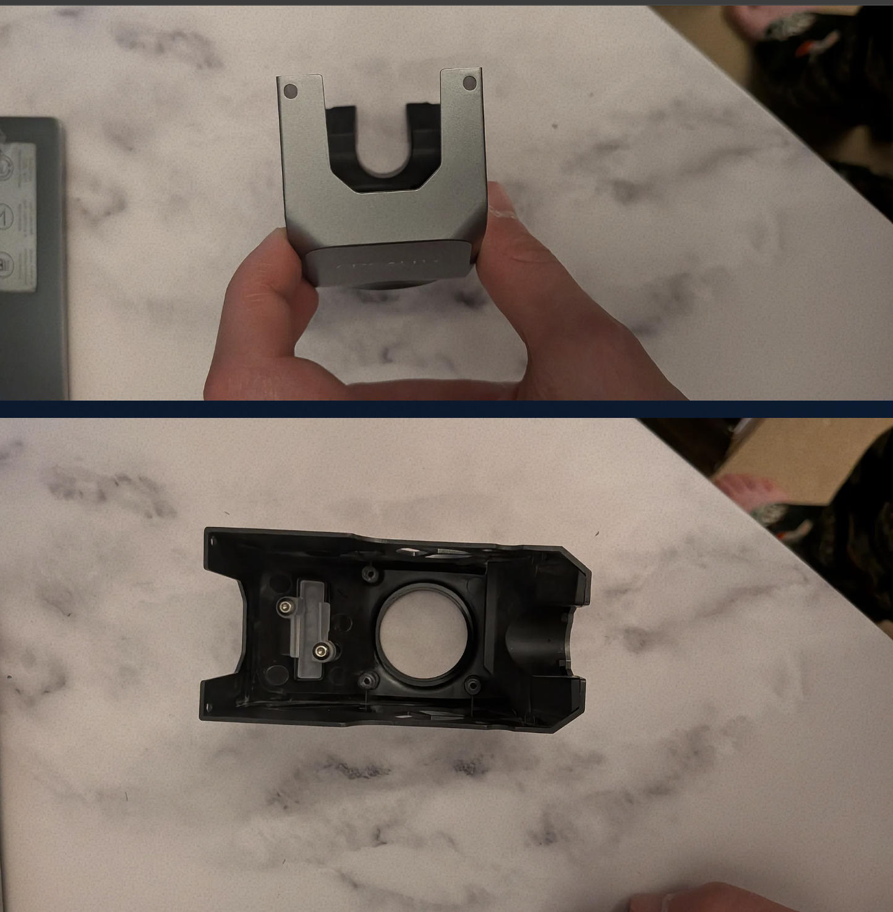
